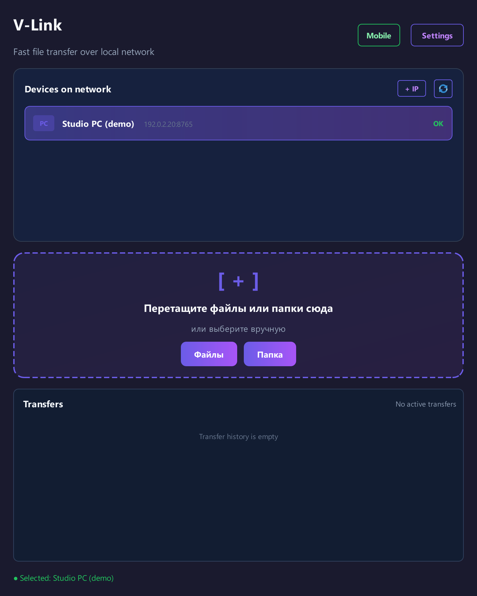
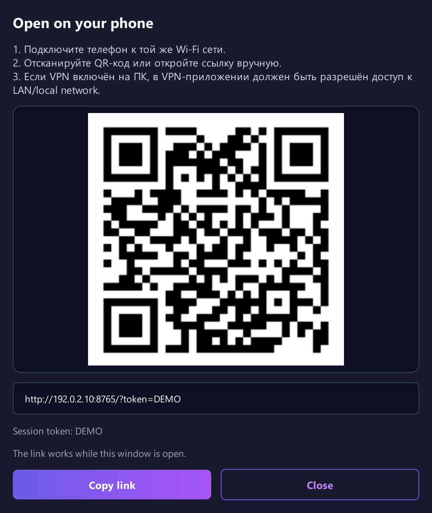

<p align="center">
  
</p>
<h1 align="center">V-Link</h1>
<p align="center"><strong>From desktop to laptop. From phone to PC.</strong><br>File sharing for Windows and your local network.</p>
<p align="center">
  <a href="https://github.com/Volfheim/V-Link/releases/latest"><strong>Download for Windows</strong></a> ·
  <a href="README.ru.md">Русский</a> ·
  <a href="CHANGELOG.md">What's new</a> ·
  <a href="https://github.com/Volfheim/V-Link/issues">Report a problem</a>
</p>

Move a project folder to your laptop, pick up a document on your phone, or send photos back to your PC. V-Link connects Windows desktops directly over the local network; Android and iOS join through a browser, with no mobile app to install.

<p align="center">
  
  <br><sub>Real interface with example data. English mode; some labels currently remain in Russian.</sub>
</p>

## One window, a few useful ways to share

- **Drop files or whole folders.** Select a desktop, drag your files into the window, and follow their progress in the transfer list. Desktop folder transfers preserve the directory structure without preparing an archive.
- **Let your phone join.** Open the mobile connection window, scan the QR code, and upload or download through the browser.
- **Find nearby desktops.** Automatic discovery, manual IP connections and a compatibility mode give you options when multicast discovery is restricted.
- **Keep it close at hand.** Tray operation, optional autostart, notifications and a background low-power mode fit into a Windows workflow.
- **Share a clipboard, too.** Text sync is on by default; image sync is optional. Read the [clipboard details](#clipboard-sharing) before using V-Link on a shared network.

## Your first transfer

1. Download **`V-Link.exe`** from the [latest release](https://github.com/Volfheim/V-Link/releases/latest) and run it on both Windows PCs. A packaged build does not require Python.
2. Connect both PCs to the same reachable local network. Select the receiving PC in the device list, or add its address with **+ IP**.
3. Drag in files or a folder, or use the file/folder buttons. Received files go to **`%USERPROFILE%\Downloads\V-Link`** by default; change the destination in Settings.

Direct LAN sharing does not require a relay server. If you enable **Secure mode**, use the same shared key and security setting on both PCs.

## A phone only needs a browser

1. Connect your phone to the same reachable Wi-Fi network as the PC.
2. Click **Mobile** / **Мобильник** on the PC and scan the QR code, or open the displayed link manually.
3. Upload to the PC or download files from V-Link's configured download folder. To make a PC file available to the phone, place it in that folder.
4. Close the mobile connection window when finished to revoke the session's access.

<p align="center">
  
  <br><sub>Real interface with example data. The illustrated QR code and DEMO token are inactive.</sub>
</p>

The link carries a **reusable token for the current session**, valid until the connection window closes. Anyone with that link and network access can use the mobile share, including access to files already in the download folder. Mobile web and WebDAV use **HTTP without transport encryption**; use them on a trusted network.

<details>
<summary><strong>Downloading folders with WebDAV</strong></summary>

For a compatible file manager, use `http://<PC-IP>:<port>/webdav/`, any username and the current mobile session token as the password. Keep the mobile connection window open. This endpoint supports browsing and downloading, not WebDAV uploads. Folder handling in the browser depends on the browser's capabilities; WebDAV is an alternative for downloading a directory tree.

</details>

## Know which connection you are using

| Mode | How it works | Protection and limits |
| --- | --- | --- |
| Desktop, default | Direct HTTP between PCs | Secure mode is off by default; file contents are unencrypted. |
| Desktop, Secure mode | Direct file transfer with a shared key | Source v2.4.9 separates authentication and file-encryption keys and rejects plaintext uploads. Legacy compatibility is off by default. Use a generated random shared key and trusted networks: HTTP metadata and authentication tokens remain observable and replayable. |
| Mobile web / WebDAV | Browser or file manager connects to the PC | Session-token access over HTTP. Desktop Secure mode does not turn this into HTTPS. |
| Optional relay | A separate server stores and forwards files | Update both PCs and the relay server for v2. Filenames, sizes and routing metadata remain visible to the relay. The reference server requires operator access controls and HTTPS. Legacy transfers retain the old key-disclosure flaw. |

Source v2.4.9 is being prepared for release; the download link may still serve v2.4.8 with the older key-disclosure issue. Update both PCs and any relay server together. If an older device must remain temporarily, explicitly enable **Settings → Security → Legacy compatibility (temporary)** on upgraded peers, only on a trusted network. Disable it when migration is complete. Legacy mode retains the original vulnerability; a failed authorization does not enable it automatically.

### Clipboard sharing

**Text sync is enabled by default; image sync is disabled.** Changes are sent to reachable desktops found by local discovery, rather than only the desktop selected for file transfer. Clipboard sync uses the local HTTP endpoints, including when relay file sharing is enabled. In Secure mode it uses versioned authentication with legacy fallback only when explicitly enabled, but **does not encrypt clipboard content**.

Turn it off in **Settings → Clipboard** before copying sensitive text or using an untrusted network.

<details>
<summary><strong>Guest Wi-Fi, hotspots and relay setup</strong></summary>

First check that the devices can reach each other. Try **+ IP** if discovery fails, or **Settings → Network → Non-standard network mode** for restricted multicast networks. If a VPN is active, check whether its LAN access setting permits this connection. Allow V-Link through the firewall only on networks you trust; there is no need to disable the firewall globally.

When Wi-Fi client isolation prevents direct connections, a reachable relay is a separate option. In **Settings → Network**, enable relay mode, set the server URL and enter the same channel on both PCs. A channel name groups devices; it is not an access-control password.

The repository includes a [reference relay server](relay/relay_server.py), not a hosted service. From an environment with the project dependencies installed:

```powershell
python relay/relay_server.py
```

By default it listens on **`0.0.0.0:8090`**, stores uploads under **`./relay_storage`**, expires queued messages after **24 hours** while running, and limits an upload to **20 GiB**. These are reference-server defaults, not a secure public deployment recipe. The operator must provide appropriate access controls and HTTPS before exposing it beyond a trusted network.

</details>

## Run from source

The desktop application targets **Windows**. **Python 3.13** is the documented development target. Run these commands in PowerShell:

```powershell
git clone https://github.com/Volfheim/V-Link.git
cd V-Link
py -3.13 -m venv .venv
.\.venv\Scripts\python.exe -m pip install -r requirements.txt
.\.venv\Scripts\python.exe src/main.py
```

To package the Windows executable with the existing build script:

```powershell
.\.venv\Scripts\python.exe build.py
```

The result is **`dist\V-Link.exe`**. The script installs PyInstaller and QR dependencies if missing, rebuilds its packaging output, and removes old `dist\V-Link-*.exe` files after a successful build.

Built with **Python, PyQt6, asyncio/aiohttp, Zeroconf, qasync and cryptography**. [Source dependencies](requirements.txt) · [Build script](build.py)

## Help and local data

Settings live at **`%USERPROFILE%\.v-link\settings.json`**; crash diagnostics at **`%USERPROFILE%\.v-link\vlink-crash.log`**. Closing the main window sends V-Link to the tray by default; use the tray's **Exit** action to quit.

For a [bug report](https://github.com/Volfheim/V-Link/issues), include the V-Link version, Windows version, transfer mode and steps to reproduce. Review logs before sharing them, and remove private paths, addresses and session tokens.

## License

Created by **[Volfheim](https://github.com/Volfheim)**. The [Volfheim Non-Commercial License v1.0](LICENSE) permits personal, non-commercial use. Commercial use, modification and redistribution require the author's prior written permission. The license text defines the full terms.
