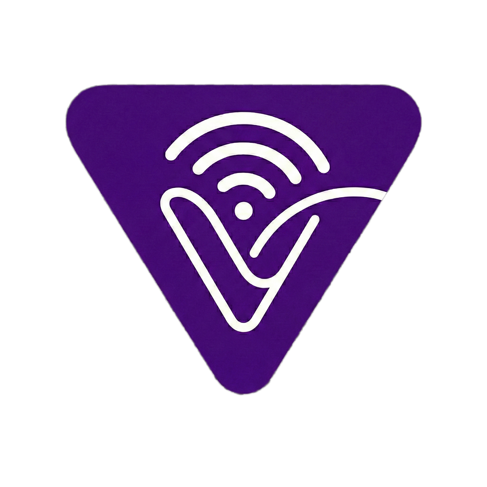
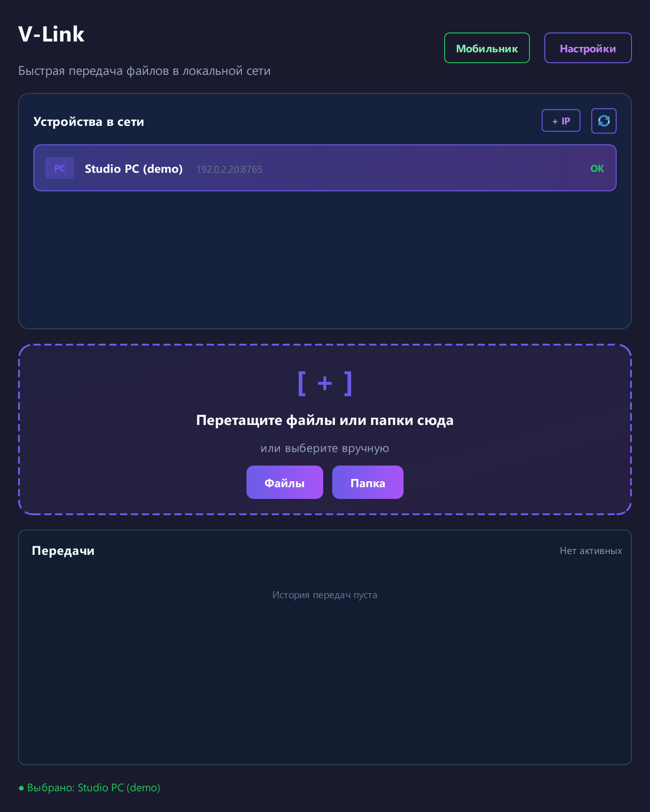
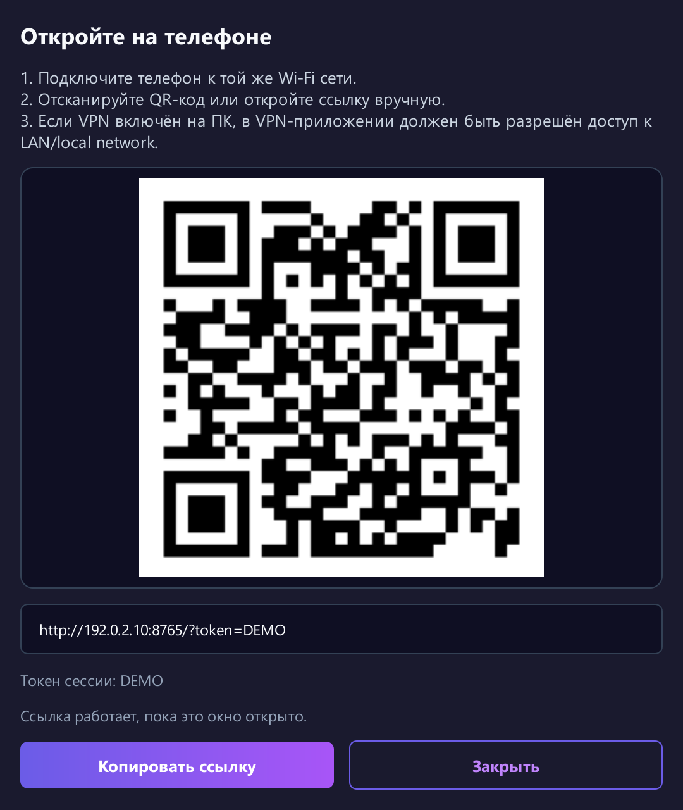

<p align="center">
  
</p>
<h1 align="center">V-Link</h1>
<p align="center"><strong>С компьютера на ноутбук. С телефона на ПК.</strong><br>Передача файлов для Windows и вашей локальной сети.</p>
<p align="center">
  <a href="https://github.com/Volfheim/V-Link/releases/latest"><strong>Скачать для Windows</strong></a> ·
  <a href="README.md">English</a> ·
  <a href="CHANGELOG.md">Что нового</a> ·
  <a href="https://github.com/Volfheim/V-Link/issues">Сообщить о проблеме</a>
</p>

Перенесите папку проекта на ноутбук, заберите документ на телефон или отправьте фотографии обратно на ПК. V-Link соединяет компьютеры Windows напрямую по локальной сети, а Android и iOS подключаются через браузер — устанавливать приложение на телефон не нужно.

<p align="center">
  
  <br><sub>Реальный интерфейс с демонстрационными данными.</sub>
</p>

## Одно окно — несколько способов поделиться

- **Перетаскивайте файлы и целые папки.** Выберите компьютер, добавьте файлы в окно и следите за прогрессом в списке передач. При передаче папок между ПК сохраняется структура каталогов, предварительно создавать архив не нужно.
- **Подключайте телефон.** Откройте окно мобильного подключения, отсканируйте QR-код и загружайте или скачивайте файлы в браузере.
- **Находите компьютеры рядом.** Автообнаружение, подключение по IP и режим совместимости помогают в сетях с ограниченным multicast.
- **Держите приложение под рукой.** Работа в трее, автозапуск по желанию, уведомления и фоновый режим низкого потребления вписываются в повседневную работу с Windows.
- **Передавайте и буфер обмена.** Синхронизация текста включена по умолчанию, изображений — по желанию. Перед работой в общей сети прочитайте [как устроена синхронизация](#синхронизация-буфера-обмена).

## Первая передача

1. Скачайте **`V-Link.exe`** из [последнего релиза](https://github.com/Volfheim/V-Link/releases/latest) и запустите на обоих компьютерах Windows. Готовой сборке Python не нужен.
2. Подключите ПК к одной локальной сети, в которой они доступны друг другу. Выберите получателя в списке устройств или добавьте его адрес кнопкой **+ IP**.
3. Перетащите файлы или папку в окно либо нажмите **Файлы** / **Папка**. По умолчанию полученные файлы сохраняются в **`%USERPROFILE%\Downloads\V-Link`**; другую папку можно выбрать в настройках.

Для прямой передачи по локальной сети relay-сервер не требуется. Если включаете **Безопасный режим**, задайте одинаковый общий ключ и режим защиты на обоих ПК.

## Телефону достаточно браузера

1. Подключите телефон к той же Wi-Fi сети, что и ПК, с возможностью связи между ними.
2. Нажмите **Мобильник** на ПК и отсканируйте QR-код либо откройте показанную ссылку вручную.
3. Загружайте файлы на ПК или скачивайте их из папки загрузок V-Link. Чтобы файл с ПК стал доступен телефону, поместите его в эту папку.
4. Закончив передачу, закройте окно мобильного подключения — доступ по этой сессии прекратится.

<p align="center">
  
  <br><sub>Реальный интерфейс с демонстрационными данными. QR-код и токен DEMO на изображении неактивны.</sub>
</p>

Ссылка содержит **многоразовый токен текущей сессии**, действующий до закрытия окна подключения. Тот, у кого есть ссылка и сетевой доступ к ПК, может пользоваться мобильной передачей, в том числе скачивать уже находящиеся в папке загрузок файлы. Мобильная страница и WebDAV используют **HTTP без шифрования транспорта** — пользуйтесь ими в доверенной сети.

<details>
<summary><strong>Скачивание папок через WebDAV</strong></summary>

В совместимом файловом менеджере укажите `http://<IP-ПК>:<порт>/webdav/`, любое имя пользователя и токен текущей мобильной сессии в качестве пароля. Оставьте окно мобильного подключения открытым. Этот интерфейс поддерживает просмотр и скачивание, но не загрузку файлов по WebDAV. Работа с папками в браузере зависит от его возможностей; WebDAV служит альтернативой для скачивания дерева каталогов.

</details>

## Какой режим подключения выбрать

| Режим | Как работает | Защита и ограничения |
| --- | --- | --- |
| Между ПК, по умолчанию | Прямое HTTP-соединение | Безопасный режим по умолчанию выключен; содержимое файлов не шифруется. |
| Между ПК, безопасный режим | Прямая передача с общим ключом | Для файлов используются Fernet и проверки SHA-256, но текущая HTTP-аутентификация раскрывает ключевой материал. Используйте только в доверенных сетях. |
| Мобильная страница / WebDAV | Браузер или файловый менеджер подключается к ПК | Доступ по токену сессии через HTTP. Безопасный режим desktop-передач не превращает это соединение в HTTPS. |
| Relay, по желанию | Отдельный сервер хранит и пересылает файлы | В безопасном режиме relay использует тот же общий ключ: его раскрытие через локальную HTTP-передачу файлов или буфера обмена затрагивает и relay-файлы, даже при HTTPS на relay. Имена, размеры и данные маршрутизации видны серверу. |

### Синхронизация буфера обмена

**Синхронизация текста включена по умолчанию, изображений — выключена.** Изменения отправляются доступным компьютерам, найденным локальным автообнаружением, а не только выбранному получателю файлов. Буфер передаётся через локальные HTTP-адреса, в том числе при включённой передаче файлов через relay. Безопасный режим добавляет аутентификацию, но **не шифрует содержимое буфера обмена**.

Выключите синхронизацию в **Настройки → Буфер обмена**, прежде чем копировать чувствительные данные или работать в недоверенной сети.

<details>
<summary><strong>Гостевой Wi-Fi, хотспоты и настройка relay</strong></summary>

Сначала проверьте, доступны ли устройства друг другу. Если не работает автообнаружение, попробуйте **+ IP** или **Настройки → Сеть → Режим нестандартных сетей** для сетей с ограниченным multicast. При активном VPN проверьте, разрешён ли в нём доступ к локальной сети. Разрешайте V-Link в брандмауэре только для доверенных сетей; полностью отключать брандмауэр не требуется.

Если изоляция Wi-Fi клиентов запрещает прямую связь, отдельный вариант — доступный обоим устройствам relay. В **Настройки → Сеть** включите relay-режим, укажите адрес сервера и одинаковый канал на обоих ПК. Название канала объединяет устройства, но не служит паролем доступа.

В репозитории есть [reference-реализация relay-сервера](relay/relay_server.py), а не готовый облачный сервис. Из окружения с установленными зависимостями проекта:

```powershell
python relay/relay_server.py
```

По умолчанию сервер слушает **`0.0.0.0:8090`**, сохраняет загрузки в **`./relay_storage`**, во время работы удаляет сообщения из очереди старше **24 часов** и ограничивает одну загрузку **20 GiB**. Это параметры reference-реализации, а не инструкция безопасного публичного развёртывания. Прежде чем открывать сервер за пределы доверенной сети, оператору нужно настроить контроль доступа и HTTPS.

</details>

## Запуск из исходников

Desktop-приложение предназначено для **Windows**. Документированная версия Python для разработки — **3.13**. Команды для PowerShell:

```powershell
git clone https://github.com/Volfheim/V-Link.git
cd V-Link
py -3.13 -m venv .venv
.\.venv\Scripts\python.exe -m pip install -r requirements.txt
.\.venv\Scripts\python.exe src/main.py
```

Для сборки Windows EXE существующим скриптом:

```powershell
.\.venv\Scripts\python.exe build.py
```

Результат — **`dist\V-Link.exe`**. Скрипт устанавливает PyInstaller и зависимости QR-кода, если их нет, пересобирает артефакты упаковки и после успешной сборки удаляет старые `dist\V-Link-*.exe`.

Стек: **Python, PyQt6, asyncio/aiohttp, Zeroconf, qasync и cryptography**. [Зависимости](requirements.txt) · [Скрипт сборки](build.py)

## Помощь и локальные данные

Настройки хранятся в **`%USERPROFILE%\.v-link\settings.json`**, диагностика сбоев — в **`%USERPROFILE%\.v-link\vlink-crash.log`**. По умолчанию закрытие главного окна сворачивает V-Link в трей; чтобы завершить приложение, выберите **Выход** в меню трея.

В [сообщении об ошибке](https://github.com/Volfheim/V-Link/issues) укажите версию V-Link, версию Windows, режим передачи и шаги воспроизведения. Перед отправкой логов удалите личные пути, адреса и токены сессий.

## Лицензия

Автор — **[Volfheim](https://github.com/Volfheim)**. [Volfheim Non-Commercial License v1.0](LICENSE) разрешает личное некоммерческое использование. Коммерческое применение, модификация и распространение требуют предварительного письменного разрешения автора. Полные условия определены текстом лицензии.
